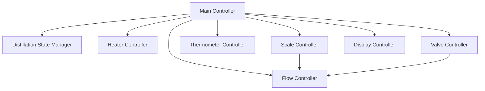
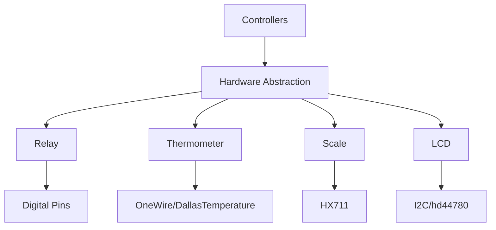
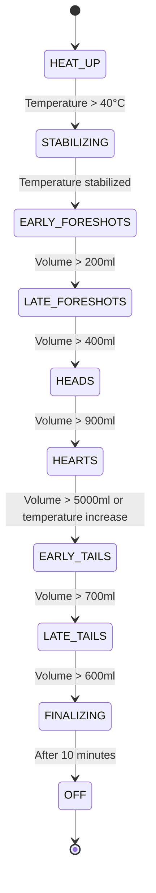
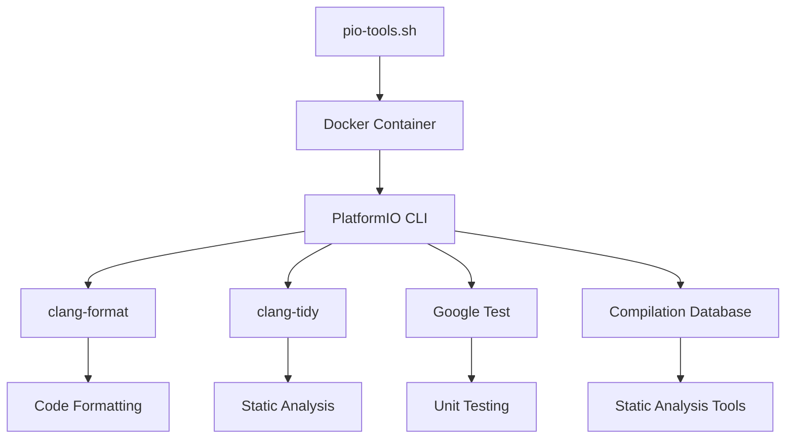

# System Patterns: Distiller

## System Architecture

The Distiller system follows a modular architecture with clear separation of concerns. The system is organized into the following key components:

### 1. Core Components



- **Main Controller**: Orchestrates the overall distillation process and manages state transitions
- **Distillation State Manager**: Manages the current state of the distillation process
- **Heater Controller**: Controls the heating elements
- **Valve Controller**: Controls the valves for different fractions and coolant
- **Thermometer Controller**: Manages temperature sensors
- **Scale Controller**: Manages weight sensors
- **Flow Controller**: Controls flow rates using PID control
- **Display Controller**: Manages the LCD display

### 2. Hardware Abstraction Layer



- **Relay**: Abstracts the control of digital output pins for heaters and valves
- **Thermometer**: Abstracts the DS18B20 temperature sensors
- **Scale**: Abstracts the HX711 load cell amplifiers
- **LCD**: Abstracts the I2C LCD display

## Key Technical Decisions

### 1. Singleton Pattern for State Management

The `DistillationStateManager` is implemented as a singleton to ensure there is only one instance managing the state of the distillation process. This prevents inconsistencies that could arise from multiple state managers.

```cpp
static DistillationStateManager &getInstance() {
  static DistillationStateManager instance;
  return instance;
}
```

### 2. Median Filtering for Sensor Readings

Both temperature and weight sensors use median filtering to reduce noise and improve measurement stability. Each sensor maintains a rolling buffer of the last 5 readings and returns the median value.

```cpp
float getTemperature() {
  float sortedReadings[5];
  std::copy(readings, readings + 5, sortedReadings);
  std::sort(sortedReadings, sortedReadings + 5);
  return sortedReadings[2]; // return the median
}
```

### 3. PID Control for Flow Rate

The system uses a PID controller to maintain a consistent flow rate by controlling the main valve. This ensures precise control over the distillation process.

```cpp
void setAndControlFlowRate(double newFlowRate) {
  // ...
  input = expectedVolume - (currentVolume - startVolume);
  pid.Compute();
  // ...
}
```

### 4. Task Scheduling

The system uses the TaskManagerIO library to schedule tasks at fixed intervals. This provides a non-blocking way to handle multiple operations concurrently.

```cpp
taskManager.scheduleFixedRate(1000, [] {
  thermometerController.updateAllTemperatures();
  scaleController.updateAllWeights();
});
```

For testing, we've implemented a custom mock for TaskManagerIO using an adapter/delegation pattern to work around Google Mock limitations with function pointers:

```cpp
// Define an abstract base class for TaskManager
class TaskManagerBase {
public:
  virtual ~TaskManagerBase() = default;
  virtual void runLoop() = 0;
  virtual void cancelTask(taskid_t taskId) = 0;
  virtual taskid_t scheduleFixedRate(uint32_t rate, void (*callback)()) = 0;
  virtual taskid_t scheduleFixedRate(uint32_t initialDelay, uint32_t rate, void (*callback)()) = 0;
};

// Create a mock implementation that uses Google Mock for the simple methods
// but custom implementation for the problematic ones
class TaskManager : public TaskManagerBase {
public:
  // Use Google Mock for simple methods
  MOCK_METHOD(void, runLoop, (), (override));
  MOCK_METHOD(void, cancelTask, (taskid_t taskId), (override));
  
  // Custom implementation for the problematic methods
  taskid_t scheduleFixedRate(uint32_t rate, void (*callback)()) override {
    // Call a mockable method that doesn't use function pointers
    return mockScheduleFixedRate2(rate);
  }
  
  taskid_t scheduleFixedRate(uint32_t initialDelay, uint32_t rate, void (*callback)()) override {
    // Call a mockable method that doesn't use function pointers
    return mockScheduleFixedRate3(initialDelay, rate);
  }
  
  // Mock methods that can be used for expectations
  MOCK_METHOD(taskid_t, mockScheduleFixedRate2, (uint32_t rate), ());
  MOCK_METHOD(taskid_t, mockScheduleFixedRate3, (uint32_t initialDelay, uint32_t rate), ());
};
```

### 5. Adapter/Delegation Pattern for Mocking

To address Google Mock limitations with function pointers, we've implemented an adapter/delegation pattern. This pattern allows us to effectively test code that uses function pointers while maintaining code quality and testability.

```cpp
// Define an abstract base class (adapter)
class TaskManagerBase {
  // Pure virtual methods define the interface
};

// Implement a mock class that inherits from the base class
class TaskManager : public TaskManagerBase {
  // Use Google Mock for simple methods
  // Custom implementation for function pointer methods
  // Delegate to mockable methods without function pointers
};
```

This pattern follows these principles:
1. **Interface Segregation**: Define a clear interface with pure virtual methods
2. **Adapter Pattern**: Create an abstract base class that adapts the function pointer interface
3. **Delegation**: Delegate function pointer methods to mockable methods
4. **Testability**: Maintain testability while working around Google Mock limitations

### 6. State-Based Control Flow

The distillation process is managed through a series of states, with each state having its own control function. This makes the code more modular and easier to maintain.

```cpp
void collectHearts() {
  DistillationStateManager::getInstance().setState(HEARTS);
  // State-specific logic...
  if (condition) {
    taskManager.cancelTask(collectHeartsTaskId);
    collectEarlyTailsTaskId = taskManager.scheduleFixedRate(1000, collectEarlyTails);
  }
}
```

## Component Relationships

### Heater Control

The HeaterController manages three heater relays, each with a different power level:
- Heater 1: 1000W
- Heater 2: 2000W
- Heater 3: 3000W

The controller activates the appropriate combination of heaters to achieve the desired power level (0-6000W).

### Valve Control

The ValveController manages 8 valves:
- 6 distillate valves (one for each fraction)
- 1 coolant valve
- 1 main valve

The controller ensures that only one distillate valve is open at a time, based on the current distillation state.

### Temperature Monitoring

The ThermometerController manages 4 temperature sensors:
- Mash tun
- Bottom
- Near top
- Top

These sensors are used to monitor the temperature at different points in the system and detect phase transitions.

### Weight Monitoring

The ScaleController manages 6 scales, one for each distillation fraction:
- Early foreshots
- Late foreshots
- Heads
- Hearts
- Early tails
- Late tails

These scales are used to measure the volume of each fraction and determine when to transition to the next phase.

## Critical Implementation Paths

### Distillation Process Flow



The system progresses through these states automatically, with each state having specific control parameters and transition conditions.

### Flow Rate Control

The flow rate control is a critical aspect of the system, as it affects the quality of the distillation. The system uses a PID controller to maintain a consistent flow rate by controlling the main valve.

1. The desired flow rate is set based on the current state and conditions
2. The system calculates the expected volume based on the flow rate and elapsed time
3. The actual volume is measured using the appropriate scale
4. The PID controller adjusts the main valve to maintain the desired flow rate

### Temperature Stabilization Detection

The system detects temperature stabilization by comparing the temperature at the bottom and top of the column. When the difference is less than 2°C, the system considers the temperature to be stabilized.

```cpp
bool isTemperatureStabilized() {
  return bottomThermometer.getTemperature() - topThermometer.getTemperature() < 2;
}
```

This is a critical condition for transitioning from the STABILIZING state to the EARLY_FORESHOTS state.

## Development Tools

### Docker-Based Development Environment

The project uses a Docker container for development tasks, ensuring a consistent environment across different machines:



- **Docker Container**: `distiller-tools` provides a consistent development environment
- **Convenience Script**: `scripts/pio-tools.sh` simplifies running commands in the container:
  - `./scripts/pio-tools.sh format` for code formatting
  - `./scripts/pio-tools.sh tidy` for static analysis
  - `./scripts/pio-tools.sh test` for unit testing
  - `./scripts/pio-tools.sh all` for running all commands

This approach ensures that all developers work with the same tools and configurations, eliminating "works on my machine" issues and simplifying the setup process.

The Docker container is configured in the `Dockerfile` and includes:
- PlatformIO CLI
- Clang tools (clang-format, clang-tidy)
- Google Test and Google Mock
- All necessary dependencies
